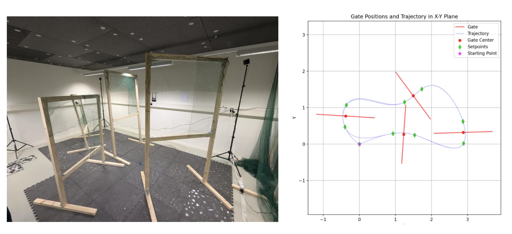

# Crazyflie 2.1 Hardware Gate Navigation

This repository contains the hardware-side code for autonomous gate navigation using the Bitcraze Crazyflie 2.1.

## Project Summary

The goal is to fly the Crazyflie through a predefined sequence of physical gates for two laps using known gate positions and dimensions. Since gate locations are already known, the hardware pipeline does not rely on onboard vision detection.

The core challenge is trajectory generation and tracking: the drone follows entry and exit waypoints around each gate (instead of only gate centers) to improve robustness during fast transitions.

- Environment: Real hardware (Bitcraze Crazyflie 2.1)
- Objective: Navigate 2 full laps through 4 spatially placed gates
- Core library: `crazyflie-lib-python` (`cflib`)
- Team: Advaith Sriram, Federico Rocca, Teo Halevi, Yugo Kadowaki, Nevo Mirzai

## Hardware Implementation

- Connects to Crazyflie over radio using `cflib`
- Reads gate positions from `gates_info.csv`
- Generates entry/exit waypoint sequences for each gate
- Computes smooth minimum-jerk trajectories between waypoints
- Sends real-time position setpoints from a ground station
- Supports emergency stop with `q`

## Repository Structure

- `path_planningfirst_csv.py`: Main hardware flight script, waypoint generation, and trajectory logic
- `visualize_path.py`: Trajectory and gate visualization utility
- `gates_info.csv`: Gate metadata used for path generation
- `images/hardware_setup.png`: Hardware setup/strategy reference

## Hardware Setup Reference



## Installation

1. Create and activate a Python environment.
2. Install dependencies:

```bash
pip install -r requirements.txt
```

## Usage

1. Update the Crazyflie URI in `path_planningfirst_csv.py` to match your radio/channel setup.
2. Confirm gate data in `gates_info.csv`.
3. Run the flight script:

```bash
python path_planningfirst_csv.py
```

Optional: visualize the planned trajectory before flight:

```bash
python visualize_path.py
```

## Safety Notes

- Keep a clear safety perimeter during hardware tests.
- Be ready to press `q` for emergency stop.
- Start with conservative timing/velocity values and tune gradually.
